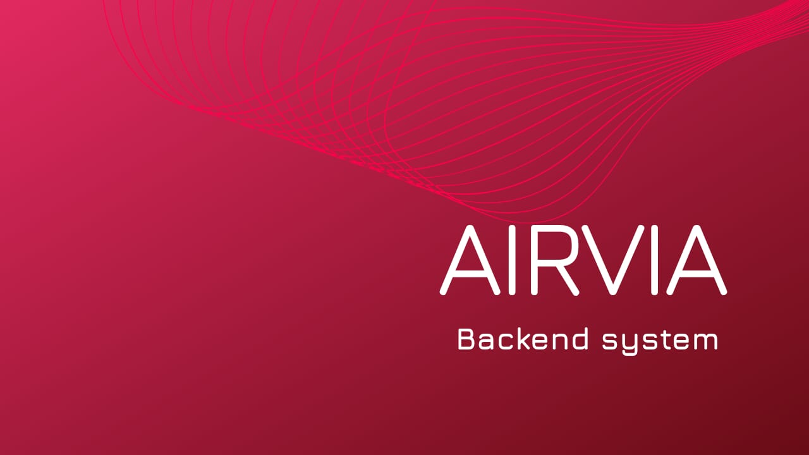

# Airvia Backend System

This project is a backend system inspired by modern booking platforms, built using **Node.js**, **Express**, and **PostgreSQL**. It focuses on managing bookings, customers, and availability while ensuring strong database consistency and clean code organization.

The system simulates a real-world reservation workflow where users can create bookings, manage customers, and track availability. A key emphasis of the project is maintaining **data integrity and reliability** using PostgreSQL’s ACID-compliant transaction system.

---

## Architecture 

The project follows a structured architecture inspired by MVC, but currently implements only the **Model and Controller layers**, since no frontend/view layer is included yet.

To enhance scalability and maintainability, the system also introduces **Service and Repository layers**.

### Controller Layer
- Handles incoming HTTP requests and sends responses  
- Acts as the entry point of the application  
- Delegates business logic to the service layer  

### Service Layer
- Contains core business logic  
- Applies rules such as booking validation, seat allocation, and status updates  
- Manages transactions to ensure consistency and reliability  

### Repository Layer
- Responsible for direct database interaction  
- Executes SQL queries using PostgreSQL  
- Abstracts database operations from business logic  

### Model / DTO Layer
- Defines structured data transfer objects  
- Ensures consistent request/response formats  
- Improves validation and type safety  

Note: The View layer is not implemented as this is a backend-only system. However, the architecture is designed to easily integrate with any frontend (React, Next.js, etc.) in the future.

---

## Application Flow

1. Client sends request (e.g., create booking)  
2. Controller receives the request  
3. Service layer processes business logic  
4. Repository interacts with PostgreSQL  
5. Response is returned through the controller  

---

## Queue System (BullMQ + Redis)

To improve performance and scalability, the system integrates a message queue using BullMQ and Redis.

### What is Redis?
- An in-memory data store used as a fast database, cache, and message broker  
- Extremely low latency, making it ideal for real-time systems  
- Stores queue data efficiently for quick access  

### What is BullMQ?
- A job queue library for Node.js built on top of Redis  
- Handles background jobs like booking processing  
- Supports retries, delays, concurrency, and job scheduling  

---

## Producer–Consumer Architecture

The system follows a producer–consumer pattern:

### Producer (Main Application)
- When a booking request is created, the system adds a job to the queue  
- This prevents blocking the main request cycle  

### Consumer (Worker)
- A separate worker process listens to the queue  
- It processes jobs asynchronously (e.g., confirming bookings, updating seats)  

---

## Why This is Efficient

- Non-blocking operations: API remains fast while heavy tasks run in the background  
- Scalability: Multiple workers can process jobs in parallel  
- Reliability: Failed jobs can be retried automatically  
- Decoupling: Booking logic is separated from request handling  
- Load handling: Smooth performance even under high traffic  

---

## Database Reliability

The system leverages PostgreSQL to ensure:

- Atomicity: Transactions either fully complete or fail entirely  
- Consistency: Constraints and relationships maintain valid data  
- Isolation: Concurrent operations do not conflict  
- Durability: Committed data is permanently stored  

---

## Key Highlights

- Backend system inspired by real-world booking platforms  
- Clean architecture using Model-Controller + Service + Repository pattern  
- Integrated BullMQ + Redis queue system for async processing  
- Implements producer–consumer pattern for scalability  
- Strong focus on ACID-compliant database reliability  
- Designed for easy future frontend integration  
